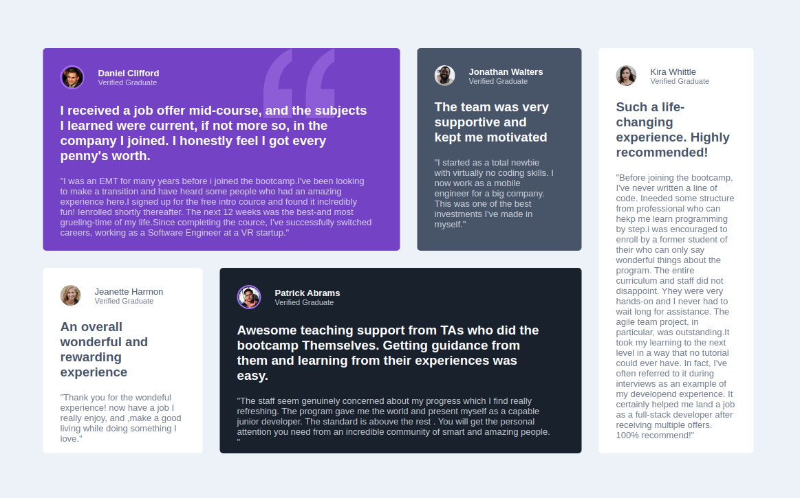

# testimonials grid section main

## Sobre o projeto

Esta é uma solução do frontend Mentor com o objetivo de construir uma grade com varios cartões, de forma que todos fiquem alinhados em um espaço específicos.

## Layout Desktop

## layout Mobile

# Estilização utilizada

## Cores

### Primária

- Moderate violet: hsl(263, 55%, 52%) 
- Very dark grayish blue: hsl(217, 19%, 35%) 
- Very dark blackish blue: hsl(219, 29%, 14%) 
- White: hsl(0, 0%, 100%)

### Natural

- Light gray: hsl(0, 0%, 81%) 
- Light grayish blue: hsl(210, 46%, 95%)

## tipografia

### Font

- Family: Barlow Semi Condensed
- Weights: 500, 600

### Body

Font size: 13px

# Tecnologias utilizadas

## Front end

- HTML / CSS 

### Modelos de layout utilizados:

- GridLayout
- FlexBox

## Implantação em produção

- Front end web: Netlify
  
  
# Challenge

- Frontend Mentor
  
  
# Meu aprendizado neste projeto
  
  Com esse projeto trabalhei bastante com o grid layout. Como os cartoẽs tinham medidas diferentes uma das outras, acabei tendo um pouco de dificuldade em organizar o grid-tamplate-areas e tambem para alinhar os itens.Tirei bastante proveito com essas dificuldades e pude evoluir bastante com elas.
  
# Autor

Wesley higino Pereira

https://www.linkedin.com/in/wesleyhigino/
